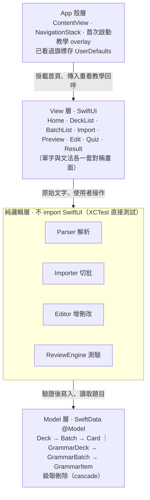
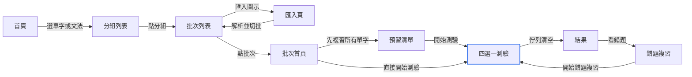
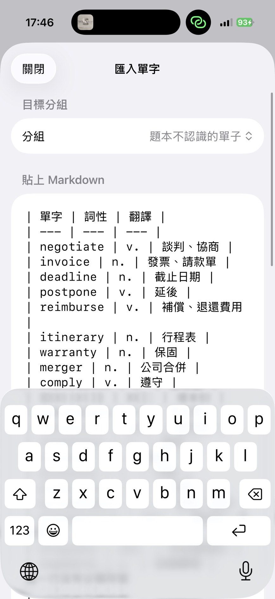
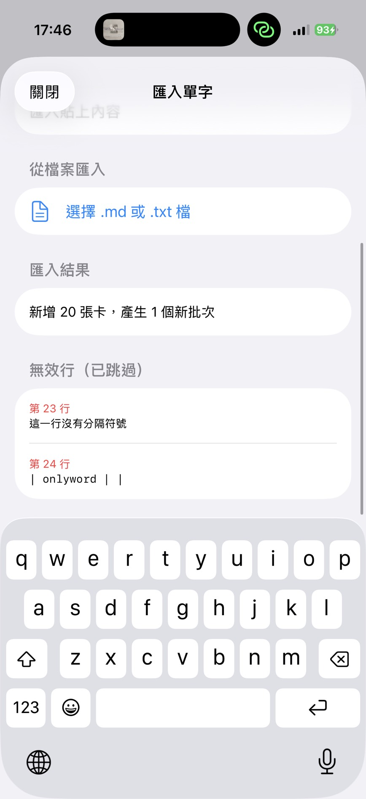
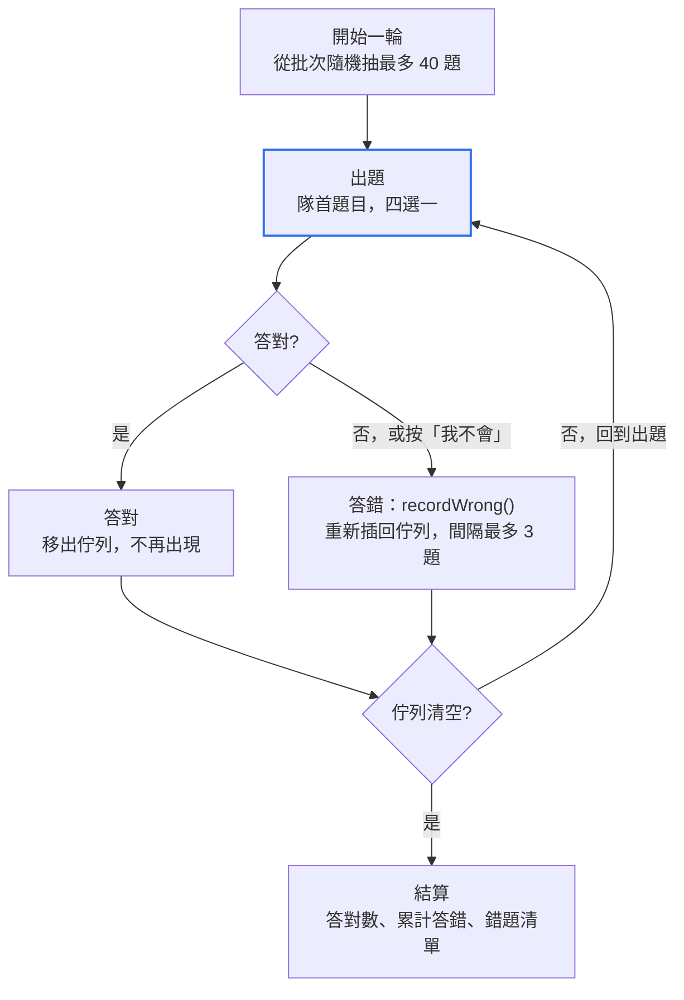
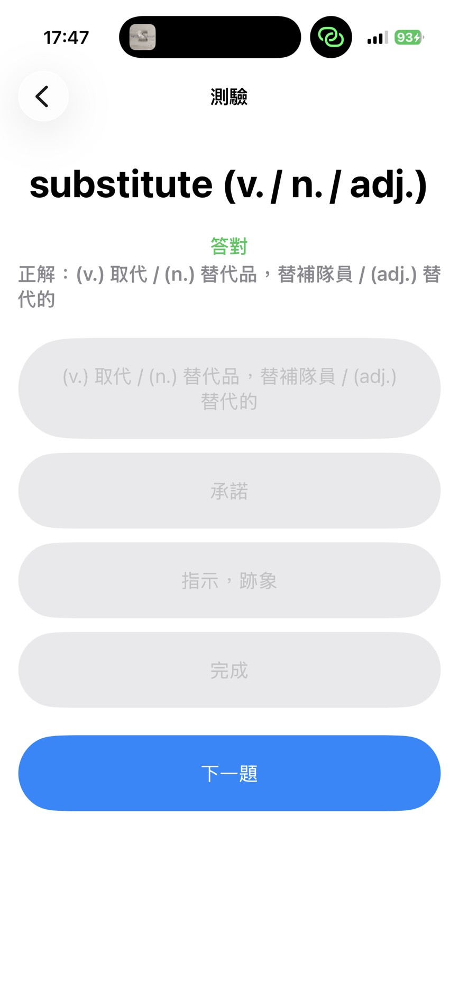
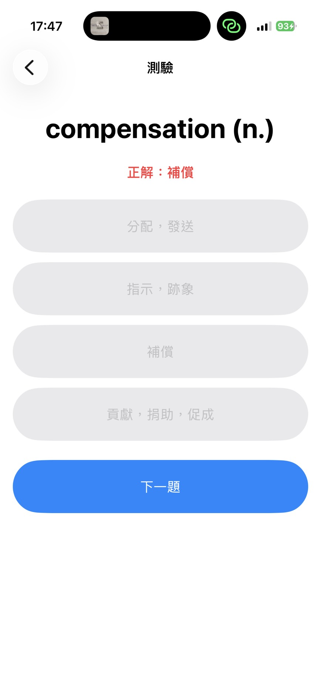
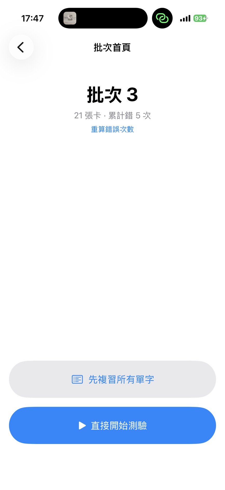

## 專案二 - VocTest 單字與文法學習 App（個人獨立開發）

* [開源程式碼連結](https://github.com/peiying004/vocabularyApp)

### 1. 專案簡介

VocTest 是一款以 Swift、SwiftUI 與 SwiftData 打造的 iOS 原生學習 App，核心概念是「貼上一段 Markdown 表格，立刻變成可反覆自我測驗的題庫」。使用者可直接貼上或匯入 .md / .txt 檔，系統會容錯解析、自動以每 40 題切成批次，並產生四選一測驗；答錯的題目會被重新插回佇列後方再問一次，直到本輪全部答對為止。

App 提供兩條平行的學習路線：

| 路線 | 題型 | 資料階層 |
| --- | --- | --- |
| 單字 | 看英文單字，四選一選出正確中文翻譯 | Deck → Batch（每 40 張）→ Card |
| 文法 | 填空題四選一，可附詳解 | GrammarDeck → GrammarBatch（每 40 題）→ GrammarItem |

除測驗外，App 亦內建預習清單、錯題複習、結果統計、多層級多選刪除、匯入後就地編輯、批次容量控管與首次啟動教學，並以 XCTest 對解析、切批、編輯與測驗狀態機進行單元測試。

### 2. 研究動機

在準備考試的過程中，我深刻體會到「測驗」是驗證學習成效的關鍵，而最花時間的往往不是找題目，而是把題目變成能反覆自我測驗的形式。市面上多數單字或題庫 App 不僅需要付費，輸入與輸出格式也往往受限，無法滿足我「大量自訂資料匯入」的需求。

因此，我決定自行開發一款學習工具，鎖定三個目標：

1. **格式彈性**：支援 Markdown 表格批次匯入，容錯處理表頭、分隔列與無效行，不強迫使用者遷就固定模板。
2. **專注測驗與錯題**：答錯的題目自動重新入列、累計錯誤次數，並可只針對錯題再測一輪。
3. **純 iOS 原生、離線可用**：不依賴後端或帳號，資料完全存在裝置內。

這也是一次完整的獨立開發練習：從需求定義、架構設計、資料模型、測試到文件，全部由一人完成。

### 3. 系統架構與流程圖

#### 3.1 分層架構

系統分為四層，依賴方向由上往下單向：畫面使用邏輯，邏輯寫入資料，反向不成立。所有可測試的行為（解析、切批、編輯、測驗）都落在不依賴 SwiftUI 的純邏輯層。

| 層級 | 職責 | 主要元件 |
| --- | --- | --- |
| App 殼層 | 建立 NavigationStack，疊上首次啟動教學 | ContentView、OnboardingOverlayView、UserDefaults 旗標 |
| View 層 | 呈現與互動，不含業務規則 | HomeView、DeckList、BatchList、Import、Preview、Edit、Quiz、Result |
| 純邏輯層 | 解析、切批、容量守則、測驗狀態機 | MarkdownParser、CardImporter、CardEditor、QuizSession（文法側各有對稱版本） |
| Model 層 | SwiftData 持久化，級聯刪除 | Deck → Batch → Card；GrammarDeck → GrammarBatch → GrammarItem |

箭頭只由上往下：畫面呼叫邏輯、邏輯寫入資料，反向不成立。中間的純邏輯層是整個系統的核心，也是單元測試覆蓋的重點。

#### 3.2 資料模型

兩條路線都是三層階層，以 `@Relationship(deleteRule: .cascade)` 定義級聯刪除：刪除分組自動連帶刪除批次與題目。

| 模型 | 關鍵欄位 | 設計重點 |
| --- | --- | --- |
| Deck / GrammarDeck | name、createdAt、batches | `reindexBatches()` 刪批後重新連號 |
| Batch / GrammarBatch | index、createdAt、cards | index 刻意可寫供重新編號；cards 為 `private(set)`，只能透過反向關聯加入 |
| Card | word、partOfSpeech?、translation、wrongCount、importOrder | wrongCount 為 `private(set)`，只能由 `recordWrong()` 遞增、`resetWrongCount()` 歸零 |
| GrammarItem | question、correct、distractors（3 個）、explanation?、wrongCount、importOrder | 同上；題目自帶誘答選項 |

#### 3.3 使用者操作流程

從首頁進入分組、匯入切批、測驗到錯題複習，整條動線如下圖；錯題複習結束後可再開一輪，形成學習回路。

箭頭上的字就是畫面上按鈕的文字。兩個回路分別是「匯入後回到批次列表」與「錯題複習再開一輪測驗」。

<table>
  <tr>
    <td align="center"></td>
    <td align="center"></td>
  </tr>
  <tr>
    <td align="center">圖 1a：貼上 Markdown 表格</td>
    <td align="center">圖 1b：匯入結果與無效行行號</td>
  </tr>
</table>

#### 3.4 匯入與切批資料流

1. 使用者貼上 Markdown 或選擇 .md / .txt 檔。
2. Parser 逐行以 `|` 切欄，自動略過表頭與分隔列；支援 2 欄（單字、翻譯）或 3 欄（單字、詞性、翻譯）。無法解析的行回傳行號，不中斷整次匯入。
3. Importer 依 `chunkSize = 40` 切批，批次編號接續既有最大值，多次匯入不重疊。
4. 每張卡記錄 `importOrder`，供預習與錯題清單依原序呈現。
5. 批次只在寫入內容的同時建立，不存在空批次。

#### 3.5 測驗狀態機

`QuizSession` 以一個 `remaining` 佇列驅動一輪測驗：隊首即目前題目，答對移除，答錯則記錄錯誤並重新插回佇列（間隔最多 3 題），直到佇列清空才結算。單字題的三個干擾選項優先從同批抽取，不足才擴及同分組其他批次；文法題則直接使用題目自帶的誘答。

答對數以「本輪總題數減去去重後的錯題數」計算，累計答錯次數則同一題重複答錯會多次計入，兩個數字分開呈現。

<table>
  <tr>
    <td align="center"></td>
    <td align="center"></td>
  </tr>
  <tr>
    <td align="center">圖 2a：四選一答對</td>
    <td align="center">圖 2b：答錯即時顯示正解</td>
  </tr>
</table>

<table>
  <tr>
    <td align="center"></td>
  </tr>
  <tr>
    <td align="center">圖 3：批次首頁顯示累計錯誤次數，可重算歸零</td>
  </tr>
</table>

### 4. 使用技術與技術亮點

| 類別 | 技術 |
| --- | --- |
| 語言 | Swift 5 |
| UI | SwiftUI（NavigationStack、List、Form、overlay） |
| 資料持久化 | SwiftData（@Model、@Query、@Relationship、ModelContext） |
| 測試 | XCTest，以記憶體內 ModelContainer 進行單元與驗收測試 |
| 建置 | Xcode，iOS 17.0+ |
| 開發方法 | 規格驅動開發（Spec-Driven Development），每個功能先寫 spec 再實作 |

**純邏輯層與 UI 徹底解耦**
實作四層分層架構，將 View（SwiftUI）、純邏輯層（Parser / Importer / Editor / ReviewEngine）與 Model 層（SwiftData）徹底分離。解析模組與測驗狀態機都是純 Swift 的 enum 靜態方法或獨立 class，不 import SwiftUI，因此可以直接用 XCTest 驗證，不必啟動畫面。目前共有 13 個測試檔、143 個測試案例，測試程式碼約 2,700 行，對應約 4,300 行的 App 程式碼。

**保護性資料封裝**
以 SwiftData 的 `@Relationship(deleteRule: .cascade)` 定義級聯刪除，刪除分組自動清除底下所有批次與題目，不留孤兒資料。核心統計欄位 `wrongCount` 設為 `private(set)`，外部只能透過 `recordWrong()` 遞增、`resetWrongCount()` 歸零兩個具名方法變更；批次的 `cards` 陣列同樣為 `private(set)`，只能透過反向關聯加入。這些限制讓「誰能改什麼」在型別層級就被鎖住。

**容錯解析與單一切批實作**
Markdown 解析器自動略過表頭與分隔列，支援 2 欄與 3 欄格式，無法解析的行回傳行號而不中斷匯入。批次容量 40 是硬上限：單筆新增、批量貼上與匯入共用同一個 `capacity` 與 `isValid`，不可能出現「單筆守上限、批量不守」。貼上超量時先不寫任何一筆，由使用者選擇「開新批次」或「放棄」；溢出部分交回 Importer 切批，專案中因此只有一處切批實作，溢出建立的批次與直接匯入的結果完全一致。

**以佇列驅動的測驗狀態機**
`QuizSession` 用一個佇列完成「答錯重問」：答錯的題目插回佇列後方、間隔最多 3 題再問，直到全部答對。干擾選項優先從同批次抽取，不足才擴及同分組，避免在幾張錯卡之間亂猜。狀態機提供一個不洗牌的測試用建構子，讓答錯重新入列、去重計數等行為能被確定性地驗證。

**規格驅動的開發流程**
專案以 12 份功能規格（匯入、切批、編輯、刪除、測驗複習、教學等）驅動開發，每個功能先定義需求與驗收條件，再實作與測試。容量相關的測試期望值一律由 `chunkSize` 推導，日後調整批次大小不需重寫測試。

### 5. 克服的挑戰

**挑戰一：單字與文法要不要共用底層？**
在設計兩條學習路線時，我原先考慮將兩者抽象化以共用模型、匯入器與測驗狀態機。深入分析後發現差異是本質的：文法題自帶三個誘答選項，單字題的干擾選項則要從同批次動態抽取；欄位驗證規則不同；SwiftData 的 `@Model` 對泛型支援也有限。最終我決定捨棄過度抽象，保持兩套平行且對稱的實作，只共用真正無差異的工具（例如陣列切批擴充）。這個決定增加了部分程式碼，卻換到更高的可讀性與低耦合，後續在一側新增功能時不會連帶影響另一側。

**挑戰二：SwiftData 刪除後的重新編號順序陷阱**
刪光一批的最後一筆時，要連批次一起移除再重新編號。實作時發現 SwiftData 的關聯陣列不保證在 `delete` 當下同步更新，直接重新編號會把已刪除的批次一起算進去，倖存批次拿到錯的編號。解法是將「是否清空」的判斷移到刪除之前，並在刪除批次後先 `save()` 再呼叫 `reindexBatches()`。這個順序以單元測試鎖住，避免日後迴歸。

**挑戰三：容量上限與使用體驗的平衡**
批次容量 40 是硬上限，但直接停用「＋」按鈕會讓使用者不知道為什麼不能新增。最後的設計是按鈕保持可按，滿載時改用提示視窗說明，並讓使用者選擇是否開新批次；貼上超量時先不寫入任何一筆，告知還能放幾筆、幾筆放不下，由使用者決定。無效行與超量分兩區呈現，因為它們的原因與後續動作都不同。這讓「批次不超過 40」與「不留空批次」兩個不變量在任何操作路徑下都成立。

**挑戰四：首次啟動教學的狀態該存哪裡？**
最直覺的做法是「資料庫為空就顯示教學」，但使用者把內容全部刪光是正常操作，那時不該再彈一次。最後改用 UserDefaults 的已看過旗標，首次看完才寫入，從首頁重看不動旗標，讓教學的生命週期完全不受資料變動影響。

### 6. 小總結

VocTest 從一個很具體的個人需求出發：把自己整理的 Markdown 題庫變成能反覆測驗的工具。開發過程中最大的收穫不是某個功能，而是學會在「抽象共用」與「平行對稱」之間做取捨，以及把規則放在不依賴 UI 的層級，讓每一個不變量都能被測試鎖住。

這個專案展現了我在 iOS 原生開發（SwiftUI + SwiftData）、分層架構設計、以測試驗證核心邏輯，以及從需求到文件獨立完成一個產品的能力。後續若要擴充（例如間隔複習排程、匯出錯題），現有的純邏輯層與規格文件已經留好了接點。

---

### 附錄：截圖對照

截圖放在 `docs/screenshots/`，檔名依文中順序編號。

| 檔名 | 對應 | 內容 |
| --- | --- | --- |
| 01-import-paste.jpg | 圖 1a | 匯入頁，貼上含表頭的 Markdown 表格 |
| 02-import-result.jpg | 圖 1b | 匯入結果：新增 20 張卡、產生 1 個新批次，第 23、24 行列為無效行 |
| 03-quiz-correct.jpg | 圖 2a | 四選一測驗，答對回饋 |
| 04-quiz-wrong.jpg | 圖 2b | 四選一測驗，答錯後顯示正解 |
| 05-batch-home-wrongcount.jpg | 圖 3 | 批次首頁：21 張卡、累計錯 5 次，可重算錯誤次數 |
