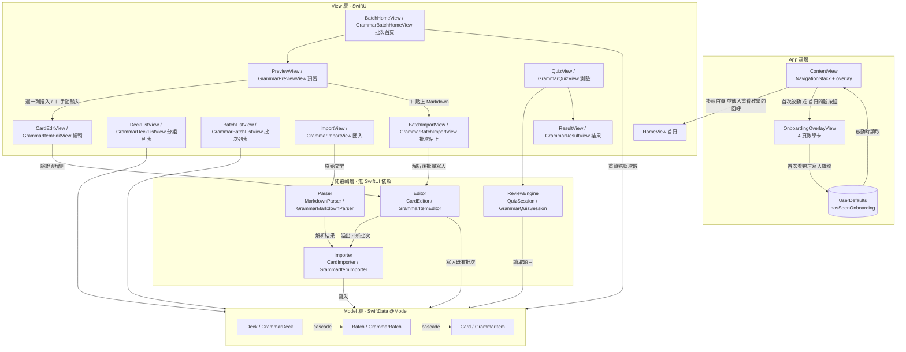
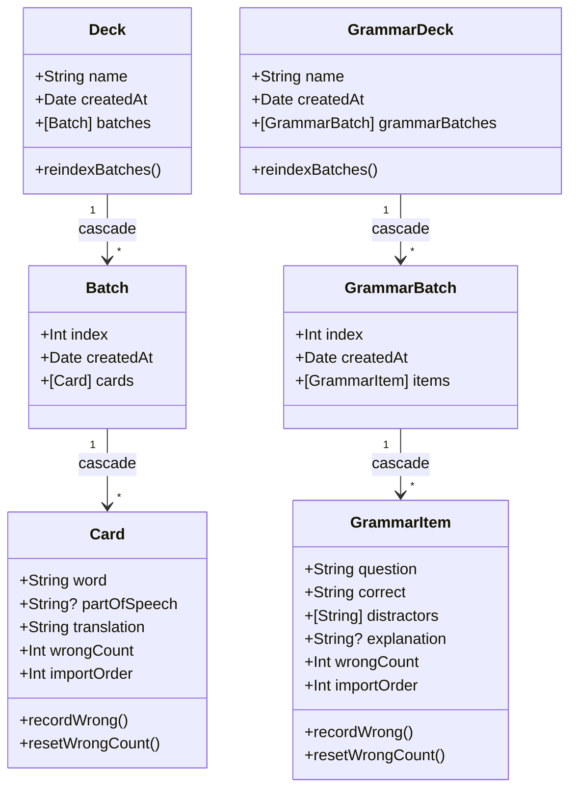
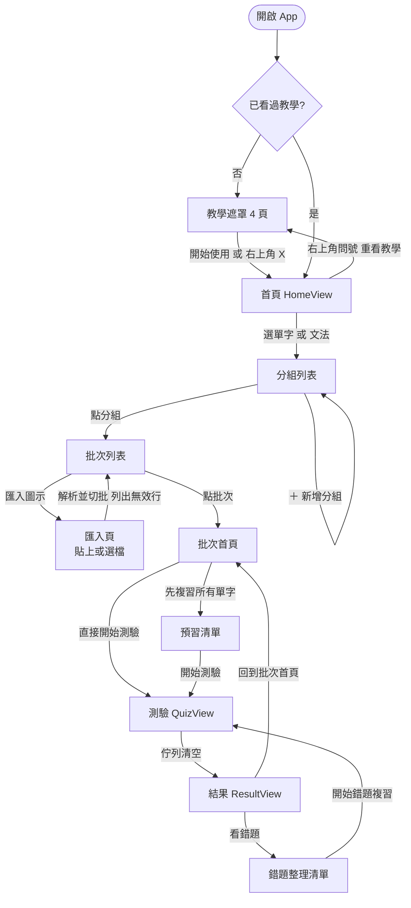
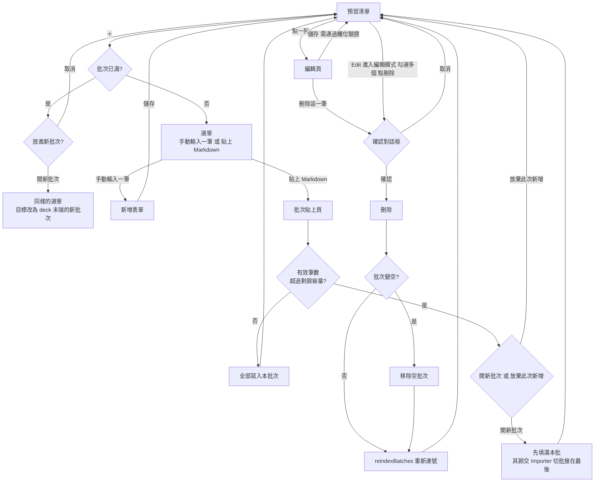

# 架構設計

> ← 回到 [專案首頁](../README.md)

本文件說明 VocTest 的分層架構、資料模型、使用者操作流程、專案結構與設計取捨。

- [先讀這裡：如何看懂本文件的圖](#先讀這裡如何看懂本文件的圖)
- [整體架構](#整體架構)
- [資料模型](#資料模型)
- [使用者操作流程](#使用者操作流程)
- [專案結構](#專案結構)
- [設計取捨](#設計取捨)

---

## 先讀這裡：如何看懂本文件的圖

本文件的圖是用 [Mermaid](https://mermaid.js.org/) 畫的（一種用文字描述、由系統自動排版的圖）。在看下面各張圖之前，先記住這張「符號對照表」就不會卡住：

| 你會看到的符號 | 代表的意思 |
|----------------|------------|
| **方形節點** `[HomeView 首頁]` | 一個「東西」：一個畫面、一個元件、或一個步驟 |
| **菱形節點** `{批次是否變空?}` | 一個「判斷」：這裡要做決定，會依「是／否」走向不同方向 |
| **箭頭** `A --> B` | 「A 指向 B」：資料流向、或操作的下一步 |
| **箭頭上的字** `-->｜原始文字｜` | 說明這條箭頭「傳遞的是什麼」或「在什麼情況下走」 |
| **`?`（接在型別後面，如 `String?`）** | Swift 語法，代表這個欄位**可以留空（nil）**；沒有 `?` 就代表**一定要有值** |
| **`?`（出現在菱形的中文句子裡）** | 只是普通的疑問句，用來問「往哪個方向走」，與 Swift 無關 |
| **`cascade`（級聯）** | 刪除上層時，會自動連帶刪掉底下所有相關資料 |

> 小提醒（給 Swift 新手）：型別後面的 `?` 是全文件最常見、最容易誤會的符號。看到 `String?` 就想成「**這格文字可以空著**」，看到 `String`（沒問號）就想成「**這格一定要填**」。

**幾個一直出現的名詞（用「活頁夾」來想）**：

| 名稱 | 中文 | 比喻 | 說明 |
|------|------|------|------|
| **Deck** | 分組 | 一本活頁夾 | 最大的分類，例如「多益單字」「日檢 N2」。 |
| **Batch** | 批次 | 活頁夾裡的一個分頁 | 分組底下切成一份份，通常每次匯入或每 N 個自動成一批，方便分次背。 |
| **Card / GrammarItem** | 單字卡 / 文法題 | 分頁裡的一張張小卡 | 最小單位：單字路線是單字卡，文法路線是選擇題。 |

> 例：一本「多益單字」Deck，貼上 300 個字、每 40 個切一批 → 產生 8 個 Batch，前 7 個各 40 張 Card、最後一個 20 張。文法路線（`GrammarDeck` → `GrammarBatch` → `GrammarItem`）結構完全對稱，批次大小同為 40。

---

## 整體架構

採分層架構，UI 只負責呈現與互動，所有可測試的邏輯（解析、測驗、切批）都放在不依賴 SwiftUI 的純邏輯層。

**怎麼看這張圖**：圖分成四個大框，代表四層。最上層是 **App 殼層**（App 的外殼：建立導覽堆疊、決定要不要疊上首次啟動教學），第二層是**畫面**（使用者看得到的），第三層是**純邏輯**（負責運算、看不到），最下層是**資料**（存起來的東西）。箭頭代表資料的流向——順著箭頭走，就是「使用者貼上文字 → 解析 → 匯入 → 存進資料庫」的過程。重點是：箭頭**由上往下**，代表畫面會用到邏輯、邏輯會存進資料，但反過來不會，這就是「分層」。殼層裡的「已看過教學」旗標存在 `UserDefaults`（iOS 內建的簡易偏好設定儲存），不在最下層的 SwiftData 資料庫裡，所以它畫在殼層框內、不接到資料層。



**App 殼層在做什麼**：`ContentView` 建立全域的 `NavigationStack`，把 `HomeView` 放進去，並用 `.overlay` 在整個導覽堆疊之上疊首次啟動教學。教學要不要顯示，只看 `UserDefaults` 裡的 `hasSeenOnboarding` 旗標；首次看完教學才寫入，首頁右上角問號按鈕重看時不會動這個旗標。旗標刻意不用「資料庫是否為空」判斷，因為使用者把內容全部刪光是正常操作，那時不該再彈一次教學。

**分層原則**：`Parser`、`Importer`、`Editor`、`ReviewEngine` 都是純 Swift（`enum` 靜態方法或獨立 `class`），不 import SwiftUI，因此可以用 XCTest 直接測試，不必啟動畫面。

**Editor 這一層在做什麼**：`CardEditor` 與 `GrammarItemEditor` 負責匯入之後、在單一批次內的內容變更——欄位驗證（規則與解析器一致）、新增時的容量檢查與 `importOrder` 指派、更新內容欄位、刪除時的空批次移除與批次重新編號。把這些規則放在這裡而不是 View 裡，是為了讓「批次上限 40」與「批次編號連續」這兩個最需要迴歸保護的不變量能被單元測試覆蓋。

**批次貼上與溢出的資料流**：`BatchImportView` 解析 Markdown 後把結果交給 Editor 的批量寫入，Editor 先填滿目標批次，放不下的部分**再轉交給 Importer** 切批並接在 deck 末端。因此圖上 Editor 有兩條出邊：直接寫入既有批次，或把溢出交給 Importer。這樣「溢出建立的新批次」與「匯入建立的新批次」在大小、編號、`importOrder` 上必然一致，專案裡只有 Importer 一處切批實作。

批次也只在 Importer 寫入內容的同時建立，沒有任何路徑會產生空批次——這讓「批次已滿時把新內容放進新批次」不會與 `content-deletion` 的「空批次不得留存」衝突。

**為什麼重算錯誤次數不在 Editor 裡**：`BatchHomeView` 的「重算錯誤次數」直接對批次內每個項目呼叫模型自身的 `resetWrongCount()`。這個方法與 `recordWrong()` 對稱，同為 `wrongCount` 的具名寫入入口，使該屬性能維持 `private(set)`。批次層級的迴圈本身沒有規則可言（沒有驗證、沒有容量、不動階層），另立一個資料層型別只會是轉發空殼。

---

## 資料模型

兩條學習路線是**對稱**的三層階層，並以 SwiftData 的 `@Relationship(deleteRule: .cascade)` 定義級聯刪除——刪除分組會自動連帶刪除底下的批次與題目。

**怎麼看這張圖**：每個方框是一種「資料的樣子」（Swift 裡叫 `class`／類別），框裡列的是它擁有的欄位與功能。前面的 `+` 代表這個欄位是公開、外部可讀的；欄位名前的 `String`、`Int`、`Date` 是資料的種類（文字、整數、日期）；接在種類後面的 `?` 代表**可留空**（見上方圖例）。框與框之間的 `"1" --> "*"` 讀作「一個 Deck 底下可以有很多個 Batch」（1 對多）。上半部是「單字」路線，下半部是結構幾乎一模一樣的「文法」路線。



**設計重點**

- `wrongCount` 標記為 `private(set)`，外部只能透過兩個具名方法變更：`recordWrong()` 遞增、`resetWrongCount()` 歸零。沒有可任意寫入的屬性——保護資料一致性。
- `Batch.index` 刻意開放為可寫，讓刪除批次後 `reindexBatches()` 能把剩餘批次重新連號（例：刪掉批次 2 後，批次 3 變成批次 2）。

---

## 使用者操作流程

從開啟 App 到完成一輪測驗的主要動線：

**怎麼看這張圖**：把它當成「使用者的腳步路線圖」。橢圓形 `([開啟 App])` 是起點，菱形是 App 自動做的判斷，方形是一個個畫面，箭頭上的字是「使用者按了什麼」，用的就是畫面上按鈕的文字（例如「先複習所有單字」「看錯題」）。順著箭頭走一遍，就是一位使用者從打開 App、看完教學、考完一輪、複習錯題的完整過程。



> 「回到批次首頁」實際上是關閉測驗頁、回到進入測驗前的那一頁：從批次首頁按「直接開始測驗」就回批次首頁，從預習清單按「開始測驗」就回預習清單。錯題複習那一輪結束後也是同一顆按鈕、同樣的回法。

**內容管理流程**（匯入之後在預習清單裡改內容：編輯、新增、貼上、刪除）：

**怎麼看這張圖**：起點是預習清單，四個**菱形判斷**是重點。`{批次已滿?}` 決定「＋」按下去是直接出選單、還是先問要不要開新批次；`{有效筆數 超過剩餘容量?}` 是貼上 Markdown 之後的容量檢查，超量時會問你「開新批次」還是「放棄此次新增」，放棄就一筆都不寫；`{確認對話框}` 是所有刪除共用的關卡；`{批次變空?}` 是刪完後的自動整理：整批被刪空就移除該批次，不論是否變空最後都會「重新連號」（例如刪掉批次 2 後，批次 3 自動改叫批次 2）。



> 分組列表與批次列表的編輯模式多選刪除，走的是同一個「確認對話框 → 刪除 → 重新連號」關卡，只是刪除的層級不同：刪分組會連帶刪掉底下所有批次與內容，刪批次會連帶刪掉該批所有內容。

---

## 專案結構

```
VocTest/
├── VocTestApp.swift         # App 進入點，註冊六個 SwiftData model
├── ContentView.swift        # 根 view：NavigationStack + 首次啟動教學 overlay
├── Models/                  # SwiftData @Model 與資料層邏輯（無 SwiftUI）
│   ├── Deck / Batch / Card
│   ├── GrammarDeck / GrammarBatch / GrammarItem
│   ├── CardImporter / GrammarItemImporter   # 匯入切批
│   ├── CardEditor / GrammarItemEditor       # 匯入後的單筆增刪改與容量守則
│   └── Array+Chunked.swift                  # 共用切批工具
├── Parser/                  # Markdown 解析（純函式，可單元測試）
│   ├── MarkdownParser.swift
│   └── GrammarMarkdownParser.swift
├── ReviewEngine/            # 測驗狀態機（純邏輯）
│   ├── QuizSession / GrammarQuizSession
│   └── MistakeQuizSession / GrammarMistakeQuizSession
└── Views/                   # SwiftUI 畫面
    ├── HomeView / DeckListView / BatchListView / BatchHomeView / ...
    ├── OnboardingOverlayView / OnboardingPage / OnboardingIllustrations  # 首次啟動教學：遮罩、四頁內容、向量插圖
    ├── CardEditView / GrammarItemEditView   # 單筆編輯（推入）與新增（sheet）
    ├── BatchImportView / GrammarBatchImportView  # 批次層級的 Markdown 貼上
    ├── MistakeReviewView / GrammarMistakeReviewView  # 錯題整理清單，可再開一輪錯題複習
    └── ImportView / PreviewView / QuizView / ResultView / ...

VocTestTests/                # XCTest 單元測試（含 OnboardingTests、AcceptanceTests）
```

---

## 設計取捨

- **純邏輯層與 UI 解耦**：解析、切批、測驗都不依賴 SwiftUI，讓核心行為可用單元測試鎖定，UI 只做呈現。
- **單字／文法保持平行而非強行抽象**：兩側雖然結構相似，但差異是本質的（文法題自帶誘答、選項策略不同、SwiftData 對泛型支援有限），因此刻意保留兩套對稱實作，換取可讀性與低耦合，而非過早抽象。
- **保護性封裝**：`wrongCount` 用 `private(set)`，只允許透過 `recordWrong()` 遞增與 `resetWrongCount()` 歸零，避免外部誤改統計數字。
- **教學狀態存 `UserDefaults`，不用「資料庫是否為空」判斷**：首次啟動教學只看一個已看過旗標，首次看完才寫入。若改用「沒有任何分組就顯示教學」，使用者把內容全部刪光（這是正常操作）時教學會再跳出來；旗標與 SwiftData 分開存，也讓教學的生命週期完全不受資料變動影響。
