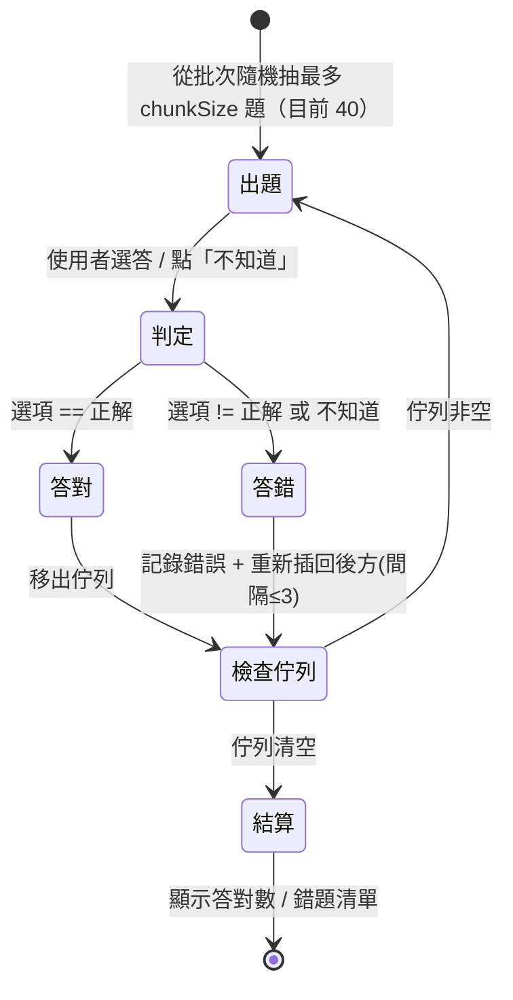

# 核心實作

> ← 回到 [專案首頁](../README.md)

本文件以程式碼範例說明 VocTest 的核心邏輯、測驗狀態機與測試方式。

- [核心邏輯與語法範例](#核心邏輯與語法範例)
- [測驗狀態機](#測驗狀態機)
- [測試](#測試)

---

## 核心邏輯與語法範例

### 1. SwiftData 資料模型（`@Model` + 級聯刪除）

```swift
import SwiftData

@Model
final class Deck {
    var name: String
    var createdAt: Date

    // 刪除分組時，SwiftData 自動級聯刪除底下所有批次（及其卡片）
    @Relationship(deleteRule: .cascade, inverse: \Batch.deck)
    var batches: [Batch] = []

    init(name: String, createdAt: Date = Date()) {
        self.name = name
        self.createdAt = createdAt
    }

    /// 刪除批次後，把剩餘批次重新編號成 1、2、3…（連續、不跳號）
    func reindexBatches() {
        let ordered = batches.sorted { $0.index < $1.index }
        for (offset, batch) in ordered.enumerated() {
            batch.index = offset + 1
        }
    }
}
```

### 2. Markdown 解析（容錯的表格解析器）

解析器以 `|` 切欄，支援 2 欄（單字、翻譯）或 3 欄（單字、詞性、翻譯），並自動略過表頭與分隔列；無法解析的行會回傳行號：

```swift
enum MarkdownParser {
    static func parse(_ input: String) -> (cards: [ParsedCard], errors: [ParseError]) {
        var cards: [ParsedCard] = []
        var errors: [ParseError] = []

        for (idx, rawLine) in input.components(separatedBy: .newlines).enumerated() {
            let cells = stripBoundaryPipes(rawLine.trimmingCharacters(in: .whitespaces))
                .split(separator: "|", omittingEmptySubsequences: false)
                .map { $0.trimmingCharacters(in: .whitespaces) }

            switch cells.count {
            case 3:  // 單字 | 詞性 | 翻譯
                let pos = cells[1].isEmpty ? nil : cells[1]
                guard !cells[0].isEmpty, !cells[2].isEmpty else {
                    errors.append(ParseError(lineNumber: idx + 1, rawLine: rawLine)); continue
                }
                cards.append(ParsedCard(word: cells[0], partOfSpeech: pos, translation: cells[2]))
            case 2:  // 單字 | 翻譯
                cards.append(ParsedCard(word: cells[0], partOfSpeech: nil, translation: cells[1]))
            default:
                errors.append(ParseError(lineNumber: idx + 1, rawLine: rawLine))
            }
        }
        return (cards, errors)
    }
}
```

### 3. 自動切批（把解析結果切成批次）

用一個共用的 `chunked(into:)` 陣列擴充，把卡片依固定大小切批，並延續既有批次編號：

```swift
extension Array {
    /// [1,2,3,4,5].chunked(into: 2) → [[1,2],[3,4],[5]]
    func chunked(into size: Int) -> [[Element]] {
        stride(from: 0, to: count, by: size).map {
            Array(self[$0..<Swift.min($0 + size, count)])
        }
    }
}

enum CardImporter {
    static let chunkSize = 40

    @discardableResult
    static func appendCards(_ parsed: [ParsedCard], to deck: Deck, in context: ModelContext) -> [Batch] {
        guard !parsed.isEmpty else { return [] }
        // 接續既有最大批次編號往下編，讓多次匯入的批次編號連續不重疊
        let nextIndex = (deck.batches.map(\.index).max() ?? 0) + 1

        return parsed.chunked(into: chunkSize).enumerated().map { i, chunk in
            let batch = Batch(index: nextIndex + i)
            batch.deck = deck
            context.insert(batch)
            for (j, p) in chunk.enumerated() {
                let card = Card(word: p.word, partOfSpeech: p.partOfSpeech,
                                translation: p.translation, importOrder: j)
                card.batch = batch
                context.insert(card)
            }
            return batch
        }
    }
}
```

### 3.5 匯入後的單筆增刪改（`CardEditor` / `GrammarItemEditor`）

匯入把內容切批寫入之後，`CardEditor` 與 `GrammarItemEditor` 接手單一批次內的變更。它們和 Importer 一樣是純資料層 `enum`，不 import SwiftUI，因此規則能被單元測試覆蓋。

**驗證規則與解析器一致**。單字：`word` 與 `translation` 去除前後空白後必須非空，`partOfSpeech` 可留空；文法題：`question` 與 `correct` 非空，`distractors` 恰為 3 個且每個非空，`explanation` 可留空。可留空的欄位在寫入時會把只含空白的字串正規化為 `nil`，與匯入時「留空視為未提供」一致。編輯畫面把「儲存」按鈕綁在同一個 `isValid` 上，因此不合法的資料無法進入資料庫。

**容量是硬上限，不只是切批數量**。`capacity` 直接取自對應 Importer 的 `chunkSize`，單字與文法同為 40。沒有任何路徑會讓批次超過它——不會自動溢位到下一批，也不會在使用者沒同意的情況下另開新批。

預習頁的「＋」**刻意不停用**：停用的按鈕按不下去，使用者就無從得知為什麼不能新增。滿載時改為跳出提示視窗說明，並讓使用者決定要不要把新內容放進新批次（詳見 3.7）。

**新增接在末端**。`importOrder` 取該批次現有最大值加 1（空批次則為 0），`wrongCount` 由 0 起算：

```swift
let card = Card(
    word: word,
    partOfSpeech: normalizedOptional(partOfSpeech),
    translation: translation,
    importOrder: (batch.cards.map(\.importOrder).max() ?? -1) + 1
)
card.batch = batch
context.insert(card)
```

**刪除時的順序有陷阱**。刪光一批的最後一筆要連批次一起移除、再重新編號。關鍵是「是否清空」必須在 `delete` **之前**判斷，且刪除批次後要先 `save()` 才能 `reindexBatches()`——SwiftData 的關聯陣列不保證在 `delete` 當下同步更新，否則 `deck.batches` 仍含已刪除的批次，重新編號會把它一起算進去，倖存批次拿到錯的 `index`：

```swift
let batch = card.batch
let willEmptyBatch = (batch?.cards.count ?? 0) <= 1   // 先判斷
context.delete(card)

guard willEmptyBatch, let batch else { return false }
let deck = batch.deck
context.delete(batch)
try? context.save()                                    // 先讓 context 處理刪除
deck?.reindexBatches()                                 // 再重新編號
return true                                            // 回傳批次是否被移除，供 View 決定是否關頁
```

### 3.6 錯誤次數重置（`resetWrongCount()`）

`wrongCount` 是 `private(set)`，只能透過具名方法變更。除了既有的 `recordWrong()`（只增不減），另加一個對稱的 `resetWrongCount()` 把值歸零：

```swift
func resetWrongCount() {
    wrongCount = 0
}
```

觸發點只有一個：批次首頁的「重算錯誤次數」，經確認對話框後對該批次每個項目逐一呼叫。編輯、新增、刪除內容都不會自動呼叫它。批次累計為 0 時按鈕停用，避免按下沒有效果的操作。

範圍刻意限定在批次層級，沒有分組層級或單筆層級的重置：`wrongCount` 在 App 中只有四個顯示點，全是批次聚合，使用者對這個數字的心智模型就是「這一批累計錯幾次」。

### 3.7 批次層級的 Markdown 貼上（批量寫入與溢出）

預習頁的「＋」除了手動輸入一筆，也能貼上 Markdown 一次補多筆。批量寫入同樣落在 Editor，與單筆新增共用 `capacity` 與 `isValid`，因此不可能出現「單筆守上限、批量不守」。

**剩餘容量**是 `capacity` 減去批次現有筆數，最小為 0。貼上時先用它判斷會不會超量。

**未超量**就全部寫進目標批次，`importOrder` 從該批次現有最大值加 1 起連續遞增。既有項目的內容、`wrongCount`、`importOrder` 都不動。

**超量**則先不寫任何東西，跳出確認視窗讓使用者選：

- **開新批次**：先寫入足以填滿目標批次的前幾筆，其餘**交給 Importer** 依 `chunkSize` 切批、接在 deck 末端。
- **放棄此次新增**：一筆都不寫，不留下寫到一半的狀態。

判斷會不會溢出、能不能溢出，都在寫入第一筆之前完成：

```swift
let valid = parsed.filter { isValid(word: $0.word, translation: $0.translation) }
let room = remainingCapacity(of: batch)

// 先決定，再動手：避免「填了一半才發現放不下」
if valid.count > room {
    guard allowingOverflow, batch.deck != nil else { return nil }
}
```

**溢出重用 Importer** 而不自己切批，是為了讓兩條路徑產生的批次完全一致。剩 82 筆就切成 40、40、2，和直接匯入 82 筆的結果相同；專案裡因此只有 `CardImporter` / `GrammarItemImporter` 一處切批實作。

**批次已滿**時按「＋」不是死路：提示視窗會問要不要把新內容放進新批次，選了之後同樣有手動與貼上兩條路，只是寫入目標從批次換成 deck。此時不需要容量計算，也不會有超量視窗。

**沒有空批次**。新批次一律由 Importer 在寫入內容的同時建立——手動輸入一筆走的也是同一條路，當成「只有一筆的匯入」。因此不存在「先建批次、再填內容」的中間狀態，使用者中途取消也不會留下要清理的空批次，與 `content-deletion` 的「空批次不得留存」沒有衝突。

**無效行與超量是兩件事**，畫面上分成兩區：無效行是「這幾行我看不懂」（跳過並列行號，不計入有效筆數），超量是「這批放不下」。原因不同、後續動作也不同，合併呈現會讓人搞不清楚發生什麼事。

### 4. 測驗狀態機（答錯重新入列）

`QuizSession` 用一個 `remaining` 佇列驅動測驗：答對移除、答錯重新插回後方，直到佇列清空：

```swift
@discardableResult
func submit(_ choice: Choice) -> AnswerResult {
    guard let card = remaining.first else { return .correct }

    let isCorrect = { if case .translation(let t) = choice { return t == card.translation }; return false }()

    if isCorrect {
        remaining.removeFirst()             // 答對：移出佇列，本輪不再出現
        return .correct
    } else {
        card.recordWrong()
        wrongTapCount += 1
        if mistakeCardIDSet.insert(card.persistentModelID).inserted {
            mistakeCardIDs.append(card.persistentModelID)   // 首次答錯才登記（去重）
        }
        remaining.removeFirst()
        let gap = Swift.min(remaining.count, 3)  // 間隔最多 3 題後再問一次
        remaining.insert(card, at: gap)
        return .wrong(correctTranslation: card.translation)
    }
}
```

### 5. SwiftUI 畫面（宣告式 + 資料綁定）

`@Query` 自動同步資料庫、`@State` 驅動畫面更新，刪除只需呼叫 `modelContext.delete`：

```swift
struct DeckListView: View {
    @Environment(\.modelContext) private var modelContext
    @Query(sort: \Deck.createdAt) private var decks: [Deck]   // 資料變動自動刷新畫面
    @State private var selection = Set<PersistentIdentifier>() // 編輯模式多選

    var body: some View {
        List(selection: $selection) {
            ForEach(decks) { deck in
                NavigationLink { BatchListView(deck: deck) } label: {
                    Text(deck.name).font(.headline)
                }
            }
        }
        .toolbar { EditButton() }
    }
}
```

---

## 測驗狀態機

單字測驗一輪的完整狀態轉移：



> **干擾選項策略**：單字題的三個干擾選項優先從「同一批」的其他翻譯抽取，若該批太小才擴及同分組的其他批；文法題的選項則直接來自該題自帶的 `distractors`。這確保選項有鑑別度，而不是在幾張答錯的卡之間亂猜。

---

## 測試

核心邏輯以 **XCTest** 覆蓋，使用記憶體內 `ModelContainer`，不需啟動 UI 即可驗證：

```swift
private func makeContainer() throws -> ModelContainer {
    let schema = Schema([Deck.self, Batch.self, Card.self])
    let config = ModelConfiguration(isStoredInMemoryOnly: true)  // 測試用記憶體資料庫
    return try ModelContainer(for: schema, configurations: config)
}

func testReindexAfterDeletingMiddleBatch() throws {
    // 批次 1、2、3 → 刪掉 2 → 剩下應重新連號為 1、2（原本的 3）
    // ...
}
```

測試涵蓋範圍：Markdown 解析邊界、切批規則（每批 40 且編號連續）、批量寫入的部分填入與溢出切批、測驗狀態機（答錯重新入列、結算計數）、批次重新編號與級聯刪除、單筆增刪改的驗證與容量上限（`CardEditorTests` / `GrammarItemEditorTests`），以及 `resetWrongCount()` 的歸零與重新累計行為。

容量相關的期望值一律由 `chunkSize` 推導而非寫死數字，因此日後再調整批次大小時不需要重寫這批測試。

執行：Xcode 中 `⌘U`，或

```bash
xcodebuild test -project VocTest.xcodeproj -scheme VocTest \
  -destination 'platform=iOS Simulator,name=iPhone 16'
```

---

> 想了解分層架構的全貌？見 [架構設計](architecture.md)。
> 想知道怎麼安裝執行？見 [開始使用](getting-started.md)。
