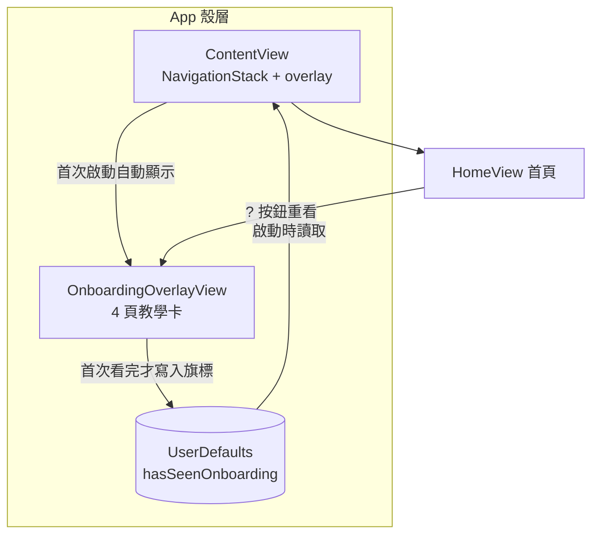
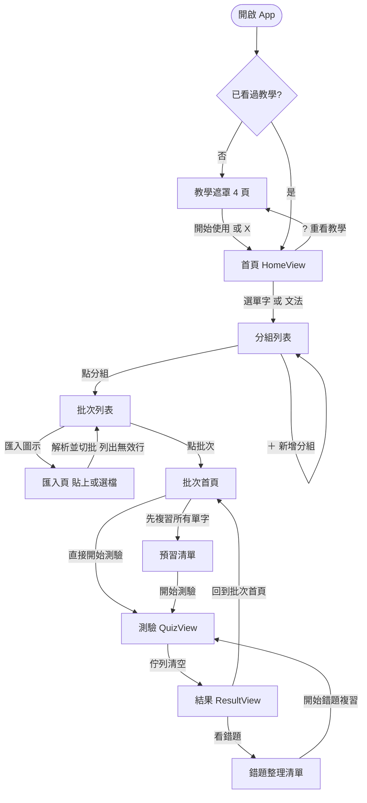
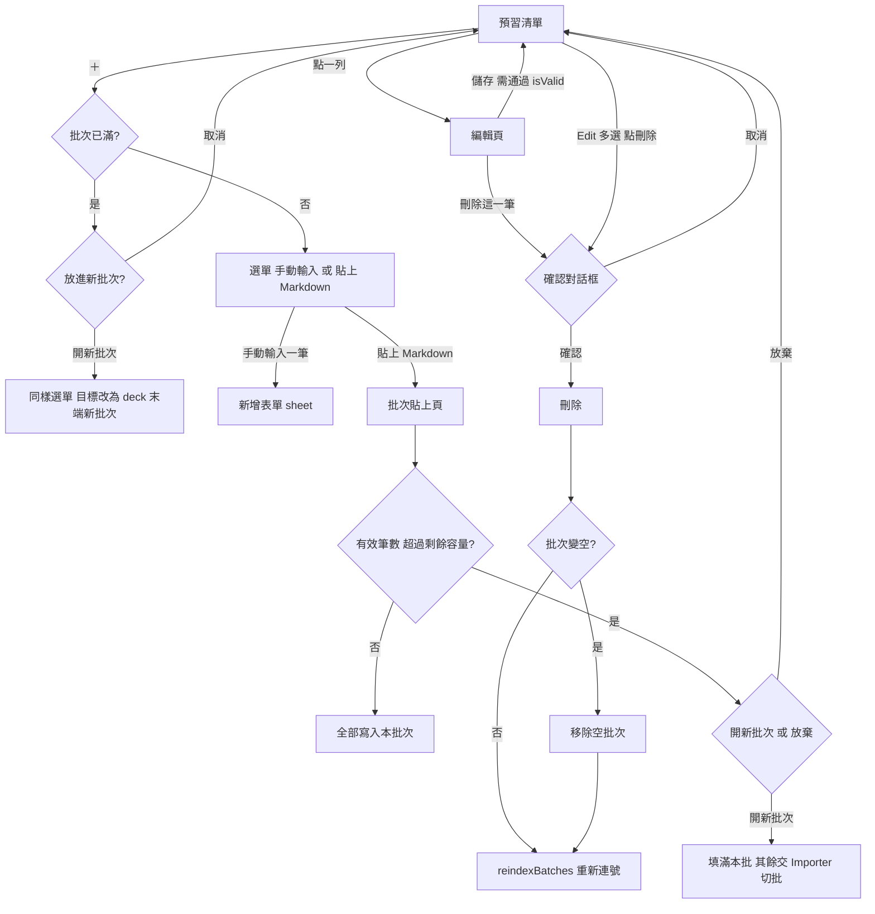

## Context

VocTest 的說明文件分成 README.md 與 docs/ 底下三份主題文件。docs/architecture.md 已經用 mermaid 畫了分層架構圖、資料模型圖、操作流程圖與多選刪除流程圖；docs/implementation.md 有測驗狀態機圖。這些圖與文字在 batch-markdown-import 與 add-onboarding-tutorial 兩個 change 之後沒有完整跟上：

- 教學功能（ContentView 的 overlay、OnboardingOverlayView、OnboardingPage、OnboardingIllustrations、HomeView 的重看按鈕、UserDefaults 的 hasSeenOnboarding 旗標）在四份文件裡完全沒有出現。
- 三處敘述與程式相反：YAML front-matter 被寫成「自動略過」，實際會列為無效行；README「自動切批」bullet 仍說不能另開新批；流程圖把結果頁回退畫成回分組列表，實際是 dismiss() 回到批次首頁或預習清單。
- 另有幾處低嚴重度偏差：狀態機圖寫「不知道」而按鈕是「我不會」；解析器範例 2 欄分支少了非空 guard；首次使用步驟少了批次首頁這一層；測試涵蓋範圖漏了 OnboardingTests 與 AcceptanceTests。

限制條件：程式、測試、既有 11 個功能 spec 都不動。文件語言為繁體中文，圖一律用 mermaid 程式碼區塊，不放圖片檔。

## Goals / Non-Goals

**Goals:**

- 四份文件的每一句功能敘述都能在目前程式碼找到對應行為，沒有相反的說法。
- architecture.md 的架構圖涵蓋 App 殼層與教學，流程圖涵蓋主流程與內容管理兩條路線，且與 View 程式碼的導覽方向一致。
- README 讀者不點進 docs/ 也能在一屏內看到精簡的架構圖與主流程圖。
- 新增 project-documentation spec，讓之後的功能 change 有一份「文件必須涵蓋什麼」的對照表。

**Non-Goals:**

- 不改任何 Swift 程式碼與測試，包含不讓解析器真的略過 front-matter。
- 不修改既有 11 個功能 spec 的需求文字。
- 不補 README 的截圖保留區，不建立 docs/screenshots/。
- 不重寫文件結構或改變三份文件的分工，只修正與補充。
- 不處理測試程式裡的舊命名（例如 testGrammarRoundSamplesUpTo20），那屬於程式端整理。

## Decisions

### 架構圖新增 App 殼層子圖而不是把教學塞進 View 層

教學 overlay 掛在 ContentView 的 NavigationStack 之上，狀態存在 UserDefaults，完全不碰 SwiftData。若把 OnboardingOverlayView 畫進 View 層、旗標畫進 Model 層，讀者會誤以為教學與 Deck 資料有關。因此在既有三層之上多一個「App 殼層」子圖，放 ContentView、OnboardingOverlayView 與 UserDefaults 旗標節點，殼層以一條箭頭連到 HomeView，教學相關箭頭只在殼層內部。

替代方案「在 View 層加一個 Onboarding 節點並註解」被否決，因為 UserDefaults 這個獨立儲存位置需要一個非 Model 層的落點，否則圖上會出現「View 直接寫入資料層以外的東西」卻沒有節點承接。

殼層草稿：

### 操作流程圖拆成主流程與內容管理兩張

現有一張流程圖只畫匯入到錯題複習。內容管理路線有點列編輯、＋選單、批次已滿提示、貼上超量選擇四條分支，加上既有的多選刪除圖，合在一張會超過 25 個節點。因此拆成：

- 主流程圖：開啟 App、教學判斷、首頁、分組列表、批次列表、匯入頁、批次首頁、預習清單、測驗、結果、錯題整理，回退箭頭以 View 程式碼的實際目標為準。
- 內容管理流程圖：以預習清單為起點，涵蓋編輯、新增、溢出、刪除，並取代原本獨立的「編輯模式多選刪除」圖。

每一條箭頭上的文字採用畫面上的按鈕或對話框實際文字，例如「先複習所有單字」「直接開始測驗」「看錯題」「開始錯題複習」「回到批次首頁」「開新批次」「放棄此次新增」，讓讀者能直接對照 App。

主流程草稿：

內容管理草稿：

### README 放精簡版圖並連到完整版

README 的定位是第一次看的人，因此在「文件導覽」之後新增「架構與流程一覽」小節，放兩張各不超過 10 個節點的圖：

- 精簡架構圖只留四層各一個節點：App 殼層、View、純邏輯、Model，外加 UserDefaults 與 SwiftData 兩個儲存節點。
- 精簡主流程圖只留六個節點：首頁、分組、批次、測驗、結果、錯題複習。

每張圖下面一行連結到 docs/architecture.md 的對應段落。替代方案「README 直接複製完整圖」被否決，完整流程圖有 18 個節點，在 README 會擠掉功能總覽。

### front-matter 敘述改為如實描述而不改程式

vocabulary-import spec 明文規定沒有 `|` 的 `---` 不是分隔列，MarkdownParserTests 的 testDashOnlyLineWithoutPipeIsNotSeparator 斷言它會產生一筆 ParseError。文件改為：「front-matter、標題等非表格行會列為無效行並跳過，其餘表格行照常匯入」。這句話同時出現在 README 功能總覽與 getting-started 匯入格式兩處，兩處用字一致。

### 每一處修正都對應到具體檔案或畫面文字

為了讓文件之後能持續對照程式，每一條新增或修正的敘述在 tasks 裡都標明它對應的來源：View 的按鈕文字、confirmationDialog 文字、或 Model 的方法名稱。例如「我不會」對應 QuizView 與 GrammarQuizView 的按鈕，「回到批次首頁」對應 ResultView 的按鈕，「批次已有 40 張卡。要把新內容放進新批次嗎？」對應 PreviewView 的對話框。這也是 project-documentation spec 的驗證基礎。

## Risks / Trade-offs

- [mermaid 語法在 GitHub 上渲染失敗，例如節點文字含 `?` 或括號被誤判] → 節點文字裡的問號只放在菱形節點內，不使用半形括號；完成後用 GitHub 或 mermaid live editor 逐張確認能渲染。
- [新增 project-documentation spec 讓之後每個功能 change 多一個要對照的東西] → 這正是目的；spec 只列「必須涵蓋的主題」與「不得出現的相反敘述」，不規定文字細節，維護成本低。
- [README 精簡圖與 architecture.md 完整圖日後再度不同步] → 精簡圖節點只到「層」與「主要畫面」層級，功能細節變動不需改它；完整圖才是隨功能更新的那份。
- [ResultView 的 dismiss() 回退目標依推入來源而異] → 流程圖箭頭文字採用按鈕文字「回到批次首頁」，箭頭指向批次首頁，並在圖下方註明從預習清單進入測驗時會回到預習清單。
